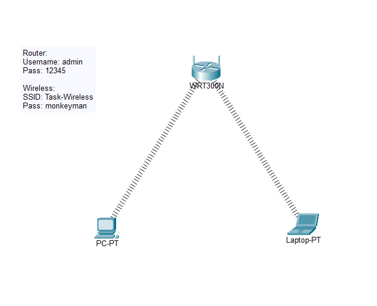

# SOHO Wireless LAN Deployment & WPA2-Personal Security

A baseline IEEE 802.11 Wireless Local Area Network (WLAN) simulation configured in Cisco Packet Tracer. Demonstrates wireless access point provisioning, SSID broadcasting, WPA2-PSK (AES) mutual authentication, centralized DHCP parameter distribution, and administrative web GUI hardening on a Linksys WRT300N wireless gateway.

---

## 📌 Topology Overview



* **Wireless Gateway (Linksys WRT300N):** Serves as the centralized 2.4 GHz 802.11b/g/n Access Point, local DHCP server, and default gateway.
* **PC-PT:** Desktop workstation retrofitted with a Linksys `WMP300N` 2.4 GHz wireless PCI network adapter.
* **Laptop-PT:** Mobile endpoint equipped with a built-in `WPC300N` wireless interface card.

---

## 📊 Wireless & Network Configuration Parameters

| Parameter | Configuration Value | Purpose / Description |
| :--- | :--- | :--- |
| **SSID (Network Name)** | `Task-Wireless` | Broadcast service set identifier for client discovery |
| **Wireless Standard / Band** | `2.4 GHz (802.11b/g/n)` | Standard commercial unlicensed frequency spectrum |
| **Security Mode** | `WPA2-Personal (AES)` | Pre-Shared Key (PSK) authentication with AES encryption |
| **Pre-Shared Key (Passphrase)**| `monkeyman` | WPA2 shared authentication secret |
| **LAN Subnet (Default)** | `192.168.0.0/24` | Local wireless broadcast domain |
| **Gateway Local IP** | `192.168.0.1` | Default router interface for wireless hosts |
| **DHCP Address Pool** | `192.168.0.100 - 192.168.0.149` | Automatic client IP parameter provisioning |
| **Admin GUI Username** | `admin` | Administrative web console access identity |
| **Admin GUI Password** | `12345` | Device management authentication credential |

---

## 🛠️ Step-by-Step Implementation Guide

### 1. WRT300N Wireless Gateway Provisioning
1. Access the **WRT300N** graphical interface (**GUI** tab).
2. Under **Setup $\rightarrow$ Basic Setup**:
   * Verify Local IP Address: `192.168.0.1`.
   * Enable the **DHCP Server** with a starting IP address of `192.168.0.100`.
3. Navigate to **Wireless $\rightarrow$ Basic Wireless Settings**:
   * **Network Mode:** `Mixed`
   * **Network Name (SSID):** `Task-Wireless`
   * **SSID Broadcast:** `Enabled`
4. Navigate to **Wireless $\rightarrow$ Wireless Security**:
   * **Security Mode:** `WPA2 Personal`
   * **Encryption:** `AES`
   * **Passphrase:** `monkeyman`
5. Navigate to **Administration $\rightarrow$ Management**:
   * Update **Router Password** to `12345` to replace factory defaults.

---

### 2. Endpoint NIC Upgrades & Association

Desktop PCs and Laptops default to copper FastEthernet interfaces in Packet Tracer. Follow these steps to associate each host:

1. **Hardware Module Installation:**
   * Open endpoint device $\rightarrow$ **Physical** tab.
   * Turn the power toggle **OFF**.
   * Drag the default copper module (`PT-HOST-NM-1CFE`) to the modules shelf.
   * Drag the wireless module (`WMP300N` or `WPC300N`) into the empty chassis slot.
   * Turn the power toggle back **ON**.

2. **Client Association (PC Wireless Utility):**
   * Navigate to **Desktop $\rightarrow$ PC Wireless**.
   * Open the **Connect** tab and click **Refresh**.
   * Select `Task-Wireless` from the available network list and click **Connect**.
   * When prompted, enter the WPA2 Pre-Shared Key: `monkeyman`.
   * Confirm the connection indicator changes to a wireless RF link.

---

## ✅ Verification & Connectivity Testing

### 1. Client IP Verification
Open the desktop command line on **PC-PT** and verify dynamic parameter acquisition via DHCP:

```text
C:\> ipconfig /all

FastEthernet0 Connection:
   Connection-specific DNS Suffix..: 
   Physical Address................: 0002.16D3.4B1A
   Link-local IPv6 Address.........: FE80::202:16FF:FED3:4B1A
   IPv4 Address....................: 192.168.0.100
   Subnet Mask.....................: 255.255.255.0
   Default Gateway.................: 192.168.0.1
   DHCP Server.....................: 192.168.0.1
   DNS Servers.....................: 0.0.0.0